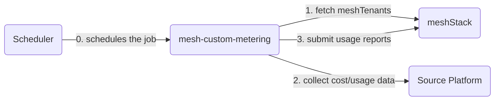

# meshStack Custom Metering Framework

A standardized, modular framework for integrating cloud platform cost and usage data with meshStack. Built with Python and designed for containerized deployment in serverless environments.

## Overview

This framework automates the collection, transformation, and submission of metering data from various cloud platforms to meshStack. It follows a modular architecture where each platform has its own implementation while sharing common core functionality.

### Key Features

- **Modular Design**: Platform-specific implementations with shared core libraries
- **Retry Mechanisms**: Built-in retry logic with exponential backoff for API calls
- **Observability**: Integrated Loki logging with structured logs and Grafana dashboards
- **Error Handling**: Robust error handling and validation
- **Containerized**: Docker-based deployment for serverless functions
- **CI/CD Ready**: Automated testing, linting, and security scanning
- **Cost Effective**: Designed for efficient execution in serverless environments

## Architecture



### Components

- **Core Library** (`src/core/`): Shared functionality across all platforms
  - `meshstack_client.py`: meshStack API integration
  - `utils.py`: Date handling and common utilities
  - `logging_config.py`: Centralized logging with Loki support

- **Platform Implementations** (`platforms/`): Platform-specific metering logic
  - OCI (Oracle Cloud Infrastructure)
  - IONOS
  - STACKIT
  - OVH
  - Tencent Cloud

## Supported Platforms

| Platform | Status | Description |
|----------|--------|-------------|
| OCI | ✅ | Oracle Cloud Infrastructure with compartment-based metering |
| IONOS | ✅ | IONOS Cloud with datacenter-based metering |
| STACKIT | ✅ | STACKIT Cloud platform |
| OVH | ✅ | OVH Cloud platform |
| Tencent | ✅ | Tencent Cloud platform |

## Quick Start

### Prerequisites

- Docker and Docker Compose
- Python 3.10+ (for local development)
- meshStack API credentials
- Cloud platform API credentials

### Building Containers

Build all platform containers:

```bash
./scripts/build-all.sh
```

Build a specific platform:

```bash
docker build -t mesh-metering-oci:latest -f platforms/oci/Dockerfile .
```

### Configuration

Each platform requires environment variables for configuration. Create a `.env` file based on the platform's `.env.example`:

```bash
# meshStack Configuration (required for all platforms)
MESHSTACK_MESHFED_URL=https://meshfed.example.com
MESHSTACK_KRAKEN_URL=https://kraken.example.com
MESHSTACK_API_USER=mesh-custom-metering
MESHSTACK_API_SECRET=your-secret-here
PLATFORM_ID=platform.identifier

# Platform-specific credentials
# (see platform .env.example files)

# Optional Configuration
USAGE_PERIOD=2024-01  # Defaults to current month
LOG_LEVEL=INFO        # DEBUG, INFO, WARN, ERROR
LOKI_URL=http://loki:3100
INCLUDE_DELETED_TENANTS=true
```

### Running with Docker Compose

The included `docker-compose.yml` provides a complete observability stack with Loki and Grafana:

```bash
# Start observability stack
docker-compose up -d loki grafana

# Run specific platform
docker-compose up oci-platform

# View logs in Grafana at http://localhost:3000
```

## Development

### Project Structure

```
mesh-custom-metering/
├── src/core/              # Shared core libraries
│   ├── meshstack_client.py
│   ├── utils.py
│   └── logging_config.py
├── platforms/             # Platform implementations
│   ├── oci/
│   │   ├── Dockerfile
│   │   ├── main.py
│   │   └── requirements.txt
│   └── ...
├── tests/                 # Test suite
│   ├── core/
│   └── monitoring/
├── scripts/               # Build and deployment scripts
└── .github/workflows/     # CI/CD pipelines
```

### Adding a New Platform

1. Create platform directory: `platforms/<platform-name>/`
2. Implement `main.py` with:
   - `get_<platform>_costs()`: Fetch cost data from platform API
   - `transform_<platform>_to_line_items()`: Transform to meshStack format
   - `process_tenant_costs()`: Process and submit usage reports
3. Create `Dockerfile` and `requirements.txt`
4. Add to `scripts/build-all.sh`
5. Create CI workflow in `.github/workflows/`

### Core Library Functions

**meshstack_client.py**:
- `get_tenants(platform_id)`: Fetch all meshTenants for a platform
- `submit_usage_report(tenant_id, date, payload)`: Submit usage report to meshStack
- `prepare_payload(line_items, platform_id, source)`: Format payload for meshStack API

**utils.py**:
- `get_current_and_last_month(usage_period)`: Calculate reporting periods
- `format_date_for_meshstack(year_month)`: Format dates for meshStack API
- `should_process_last_month()`: Determine if last month should be processed (first 5 days)

## Deployment

### Serverless Deployment

The framework is designed for serverless execution (AWS Lambda, Azure Functions, Google Cloud Functions, etc.):

1. Build platform-specific container
2. Push to container registry
3. Configure serverless function with environment variables
4. Set up scheduled trigger (e.g., cron: `0 6 * * *` for daily at 6 AM)

### Kubernetes Deployment

Use as CronJob:

```yaml
apiVersion: batch/v1
kind: CronJob
metadata:
  name: mesh-metering-oci
spec:
  schedule: "0 6 * * *"
  jobTemplate:
    spec:
      template:
        spec:
          containers:
          - name: metering
            image: mesh-metering-oci:latest
            envFrom:
            - secretRef:
                name: mesh-metering-secrets
```

## Monitoring

### Observability Stack

The framework includes integrated monitoring with:

- **Loki**: Centralized log aggregation
- **Grafana**: Pre-configured dashboards for metering insights

Access Grafana at `http://localhost:3000` (default: admin/admin)

### Key Metrics

- Tenant processing count (active/deleted)
- Cost data retrieval success/failure rates
- Usage report submission status
- Processing duration per tenant
- API retry statistics

## Configuration Options

| Variable | Required | Default | Description |
|----------|----------|---------|-------------|
| `MESHSTACK_MESHFED_URL` | Yes | - | meshStack meshfed API endpoint |
| `MESHSTACK_KRAKEN_URL` | Yes | - | meshStack Kraken API endpoint |
| `MESHSTACK_API_USER` | Yes | - | meshStack API username |
| `MESHSTACK_API_SECRET` | Yes | - | meshStack API secret |
| `PLATFORM_ID` | Yes | - | meshStack platform identifier |
| `USAGE_PERIOD` | No | Current month | Period to collect (YYYY-MM format) |
| `INCLUDE_DELETED_TENANTS` | No | true | Include deleted tenants in processing |
| `LOG_LEVEL` | No | INFO | Logging level (DEBUG, INFO, WARN, ERROR) |
| `LOKI_URL` | No | - | Loki endpoint for log aggregation |

## CI/CD

The project includes comprehensive GitHub Actions workflows:

- **Core Library CI**: Tests core functionality across Python 3.10, 3.11, 3.12
- **Platform CI**: Individual platform testing and validation
- **Security Scanning**: Automated vulnerability scanning
- **Release**: Automated container builds and releases

## Known Limitations

- meshStack Tenant Usage Reports API requires full period reports (no appending)
- meshStack API enforces mandatory parameters that may not be needed for all use cases
- Processing occurs sequentially per tenant to avoid rate limiting

## Contributing

### Development Workflow

1. Create feature branch
2. Implement changes
3. Submit pull request
4. CI pipelines validate changes

### Code Style

- Python: Follow PEP 8 (enforced by `black` and `ruff`)
- Type hints: Use type annotations (validated by `mypy`)
- Logging: Use structured logging with appropriate levels

## Support & Troubleshooting

### Common Issues

**API Authentication Errors**:
- Verify credentials in environment variables
- Check API endpoint URLs (remove trailing slashes)
- Ensure API user has correct permissions

**No Tenants Found**:
- Verify `PLATFORM_ID` matches meshStack configuration
- Check API user has access to platform tenants
- Review `INCLUDE_DELETED_TENANTS` setting

**Cost Data Not Appearing**:
- Check platform API credentials
- Verify `USAGE_PERIOD` is correct
- Review logs for transformation errors

### Debug Mode

Enable detailed logging:

```bash
LOG_LEVEL=DEBUG docker-compose up <platform>
```

## License

[Add your license here]

## Credits

Developed by meshcloud for standardized multi-cloud metering integration with meshStack.
