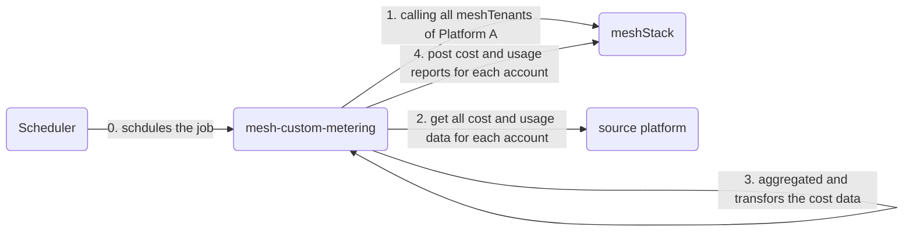
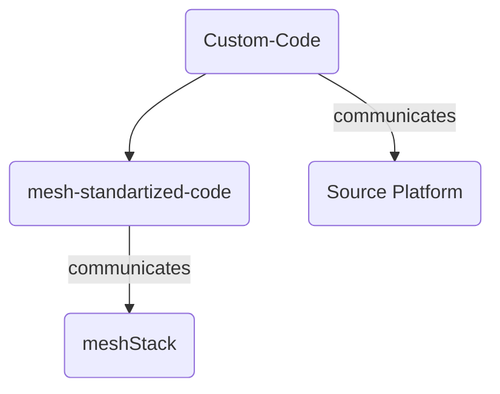

# HLA Application setup

# Application Design

# Custom-Code:
configruation items:
- platform id e.g. Entra Tenant ID / IONOS Contract ID
- credentials for the API -> usually as env variables
- workspaceID for contact
- meshStack API credentials and API base URL

- function collectionCostAndUsage(string platformTenantId, period): tempalte retry mechanism
- function transformCostAndUsage(string rawData)
- function sumCost(string platformTenantId)

# meshStandard part
- function main(): collect data based on CU, transform data CU and send data
- function currentPeriod()
- function lastPeriod()
- function collectMeshTenants(string meshPlatformID)
- function postTenantUsageReport(string meshPlatfromID)
- function postErrorNotification(string workspaceId)
- function validateCostAndUsage(period)

- Loki monitoring endpoint

# Libs we need
request
pandas
tenacity https://github.com/jd/tenacity
