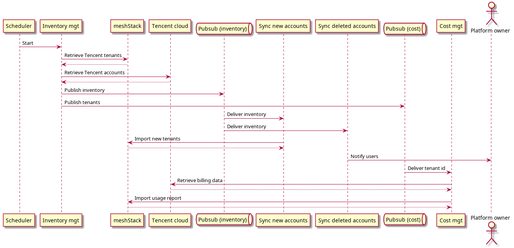
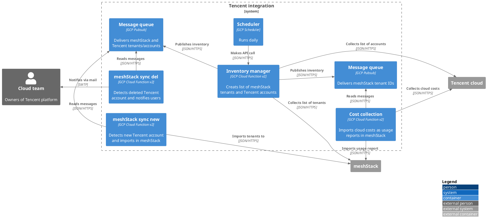
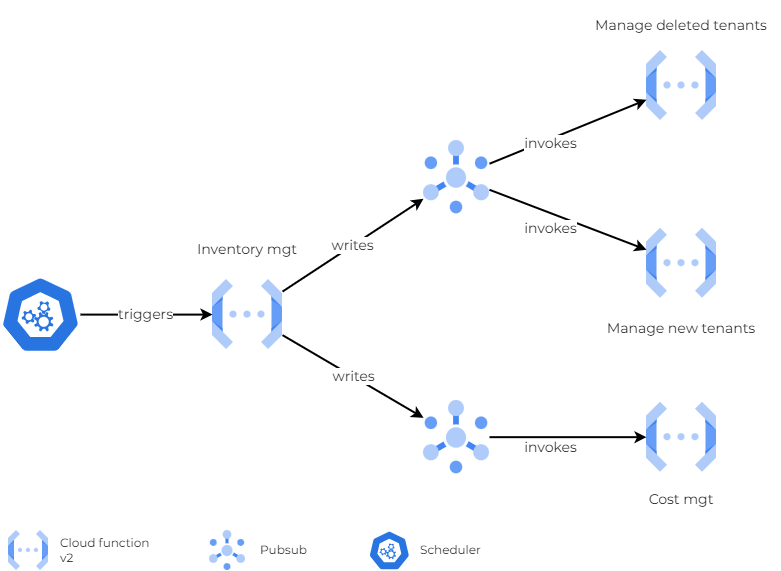

# Tencent account synchronization

## Intro

meshStack provides a versatile cloud management platform capable of integrating both established cloud providers and custom cloud platforms,
with this document detailing the specific integration approach for Tencent cloud accounts.

This solution systematically imports existing Tencent accounts into meshStack, enabling a comprehensive, unified view of the customer's
multi-cloud infrastructure and providing centralized visibility across different cloud providers. The solution focuses solely on account
synchronization and visibility, assuming that existing account management processes will handle creation and deletion of
Tencent accounts through alternative established mechanisms.

## Scope

- Detect new Tencent accounts and import in meshStack
- Collect cost for integrated Tencent accounts and import in meshStack
- Monitor and detect deleted Tencent accounts, and issue notifications to the respective platform owners

## Limitations

- All accounts are imported into the same Workspace
- The project display name and project ID match the tenant IDs
- The same tags are assigned to imported tenants, however you can specify the necessary tag values using meshStack afterword
- Tags are hardcoded

## Solution design

Under the regular plan, the solution compares the list of existing accounts in Tencent Cloud with meshStack tenants assigned to a custom platform of type Tencent. If a new account is detected in Tencent, it is imported into meshStack. During the import, a project is created, and the Tencent account is assigned as a tenant to the project.

At creation, all projects share the same workspace, tags, platform, landing zone and payment method. However, after a successful import, the tags and payment method can be adjusted as needed. The solution does not alter previously imported tenants.

In addition to importing Tencent accounts into meshStack, billing information is also regularly retrieved for all existing tenants running on the Tencent platform in meshStack. Using the Tencent SDK, costs related to the cloud resources used during the current month are retrieved for each account, aggregated by service/product name, and then imported into meshStack.



### Inventory

The inventory service aimes to retrieve the list of meshStack tenants on one hand side and the list of Tencent accounts on another. It aggregates this information in form of two lists and share with additional service called Synchronization function using a message queue.

The inventory looks as follows:

Tencent accounts

```json
[
    {
        "Uin": {            # Tencent account id -> tenant id
            "Name":     "", # Tencent account -> tenant display name
            "NodeId":   "", # OU id -> Landing Zone id
            "NodeName": ""  # OU name -> Landing zone display name
        }
    }

]
```

meshStack tenants:

```json
[
    {
        "localId": {
            "landingZoneId":        "",
            "platformIdentifier":   "",
            "projectId":            "",
            "tenantIdentifier":     ""
        }
    }
]
```

Inventory service also sends messages to additional message queue containing tenant platform IDs of Tencent tenants managed by meshStack.

The inventory service is triggered once a day.

### Synchronization

The synchronization service process received inventory of meshStack tenants and Tencent accounts. The lists contain:

- meshStack platform tenant ID (formerly local ID)
- Tencent account IDs

The service looks for each Tencent account ID in the list of meshStack platform tenant IDs. If the ID is not found, it is considered as an account recentrly created in Tencent cloud and following actions will be performced:

- using meshStack API a project is created in meshStack's designated Workspace, the platform and the landing zone. Additionally, the payment method and tags are assigned. The name of the project corresponds to the account name in Tencent cloud. The project ID is set to the Tencent account ID
- similarly, using the API a tenant is imported in the previously created project. The tenant platform ID is set to Tencent account ID

To simplify operations, this service is split into two functions: one for provisioning new Tencent accounts, and another for managing deletions.

### Cost collection

The cost collection service retrieves billing details for each Tencent tenant managed within meshStack. The list of tenants is provided by the Inventory service as messages in a message queue. Each message contains one tenant platform ID. Upon receiving the message, the cost collection service extracts billing information from Tencent using the SDK for the current month or the month specified in the environment variable. Processing each account may take up to 10 minutes, so each account is handled individually.

Finally, the received billing information is then sent to meshStack using usage report API.

The drawing below demonstrates the relationship between different components:



## Deployment

### meshStack setup

If you don't already have a Workspace, create one to consolidate all Tencent projects. Next, follow the guide at [meshcloud documentation](https://docs.meshcloud.io/docs/meshstack.how-to.create-your-own-platform.html) to create a custom Platform, skipping "Step 2: Create a Building Block". Configure Landing Zones for the Tencent Department (also referred to as an OU) to align with the structure of your Tencent Organization. Ensure the Landing Zone ID matches the Tencent Department ID. For more details on Tencent cloud organization, refer to [Tencent Cloud Documentation](https://www.tencentcloud.com/document/product/1031/32014). Finally, set up a payment method for the Workspace to manage the cloud costs associated with the Tencent accounts.

Create an API user and assign the following permissions:

- Get any meshObject (except for metering/billing meshObjects)
- Import any supported meshObjects
- Create Resource Usage Reports

### Requirements

The following tools are required for successful solution deployment:

- gcloud
- terraform > 1.4.7
- bucket to store terraform state file
- gcp project "roles/owner" to be utilized during deployment

Using the following commandes, authenticate to the gcp project and enable the required APIs:

```shell
gcloud init
gcloud auth application-default login
gcloud config set project PROJECT_ID
gcloud services enable cloudscheduler.googleapis.com pubsub.googleapis.com run.googleapis.com \
    cloudbuild.googleapis.com cloudfunctions.googleapis.com cloudtrace.googleapis.com eventarc.googleapis.com logging.googleapis.com \
    pubsub.googleapis.com secretmanager.googleapis.com storage.googleapis.com
```

Verify that the Tencent platform, corresponding landing zones and the target workspace for account import have been previously established in the meshStack.

### Configure

Configure the variables.tf and provider.tf files with settings specific to your local environment and infrastructure requirements. Customize these configuration files to accurately reflect your project's cloud provider, region, credentials, and other essential deployment parameters.

Create environment variables to store secrets for meshStack and Tencent and assign appropriate values:

```shell
export TF_VAR_tencent_secret_id="" # tencent secret id

export TF_VAR_gcp_project_id=""  # Id of GCP project where the resources will be provisioned
export TF_VAR_platform_id="", # Id of tencent platform in meshStack
export TF_VAR_workspace_id="", # Id of the meshStack workspace where the tenants should be imported
export TF_VAR_payment_id="", # Id of the payment method assigned to the workspace

export TF_VAR_mesh_api_host="", # API URL for meshStack
export TF_VAR_mesh_cost_api_host="", # API URL for mettering
export TF_VAR_mesh_api_user="" # meshstack api user

export TF_VAR_recipient_mail="" # emails (comma-separated) of users receiving tenant deletion alerts
```

### Provision resources

Clone the repository and navigate to the folder ```deployment```. While this is optional, it is recommended to modify the ```backend.tf``` file to specify a bucket for storing the state file. Run the command to deploy the solution in GCP cloud:

```terraform
terraform init
terraform plan -out saved.plan
terraform apply saved.plan
```

### Store api credentials

Although managing secrets and versions with Terraform is possible, we avoid storing sensitive information in the state file. Therefore, credentials are manually set using the GCP UI. Log in to the GCP console, select the appropriate project, and navigate to Secret Manager. For each key, ```mesh-tct-meshApiCreds``` and ```mesh-tct-tctApiCreds```, add a new version and register the secret value.

### IAM permissions for Cloud function

Due to Terraform's limited IAM policy support for Cloud Functions, manual CLI intervention is required. Carefully execute the following command, ensuring you replace the service account and cloud function names with your specific values. Customize PROJECT_ID to reflect your project.

```shell
gcloud functions add-invoker-policy-binding mesh-tct-createInventory  \
    --region="europe-west3" \
    --member="serviceAccount:mesh-tct-sacc-sched@PROJECT_ID.iam.gserviceaccount.com"
```

The diagram below depicts resources deployed in GCP

